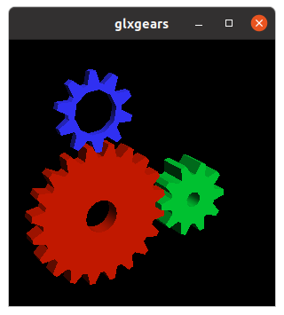
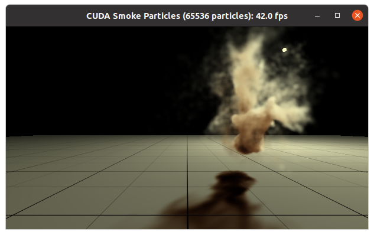

# l4t-base-docker

## Introduction

This is a Dockerfile to make L4T environment(Ubuntu 22.04) on Jetson device.  
This Dockerfile is based on [nvidia/container-images/l4t-base](https://gitlab.com/nvidia/container-images/l4t-base).

## Requirements

- Docker
- nvidia-docker2

## Build docker image

```
docker build --build-arg UID=$(id -u) --build-arg GID=$(id -g) -t l4t-base:35.3.1 .
```

## Launch docker container

```
xhost +
docker run -it --rm --net=host --runtime nvidia -e DISPLAY=$DISPLAY -v /tmp/.X11-unix/:/tmp/.X11-unix l4t-base:35.3.1 bash
```

## Reference

- <https://gitlab.com/nvidia/container-images/l4t-base>

## Appendix

I tested on Jetson Orin NX 16GB.

### glxgears



### smokeParticles



### deviceQuery

```
$ ./deviceQuery 
./deviceQuery Starting...

 CUDA Device Query (Runtime API) version (CUDART static linking)

Detected 1 CUDA Capable device(s)

Device 0: "Orin"
  CUDA Driver Version / Runtime Version          11.4 / 11.4
  CUDA Capability Major/Minor version number:    8.7
  Total amount of global memory:                 15388 MBytes (16136011776 bytes)
  (008) Multiprocessors, (128) CUDA Cores/MP:    1024 CUDA Cores
  GPU Max Clock rate:                            918 MHz (0.92 GHz)
  Memory Clock rate:                             918 Mhz
  Memory Bus Width:                              64-bit
  L2 Cache Size:                                 2097152 bytes
  Maximum Texture Dimension Size (x,y,z)         1D=(131072), 2D=(131072, 65536), 3D=(16384, 16384, 16384)
  Maximum Layered 1D Texture Size, (num) layers  1D=(32768), 2048 layers
  Maximum Layered 2D Texture Size, (num) layers  2D=(32768, 32768), 2048 layers
  Total amount of constant memory:               65536 bytes
  Total amount of shared memory per block:       49152 bytes
  Total shared memory per multiprocessor:        167936 bytes
  Total number of registers available per block: 65536
  Warp size:                                     32
  Maximum number of threads per multiprocessor:  1536
  Maximum number of threads per block:           1024
  Max dimension size of a thread block (x,y,z): (1024, 1024, 64)
  Max dimension size of a grid size    (x,y,z): (2147483647, 65535, 65535)
  Maximum memory pitch:                          2147483647 bytes
  Texture alignment:                             512 bytes
  Concurrent copy and kernel execution:          Yes with 2 copy engine(s)
  Run time limit on kernels:                     No
  Integrated GPU sharing Host Memory:            Yes
  Support host page-locked memory mapping:       Yes
  Alignment requirement for Surfaces:            Yes
  Device has ECC support:                        Disabled
  Device supports Unified Addressing (UVA):      Yes
  Device supports Managed Memory:                Yes
  Device supports Compute Preemption:            Yes
  Supports Cooperative Kernel Launch:            Yes
  Supports MultiDevice Co-op Kernel Launch:      Yes
  Device PCI Domain ID / Bus ID / location ID:   0 / 0 / 0
  Compute Mode:
     < Default (multiple host threads can use ::cudaSetDevice() with device simultaneously) >

deviceQuery, CUDA Driver = CUDART, CUDA Driver Version = 11.4, CUDA Runtime Version = 11.4, NumDevs = 1
Result = PASS
```
