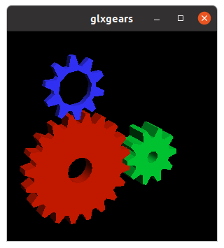
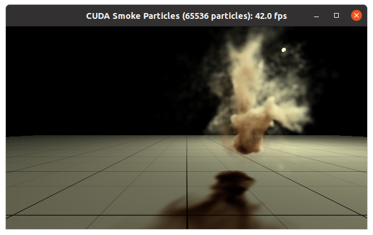

# l4t-base-docker

## Introduction

This is a Dockerfile to make L4T environment on Jetson device.  
This Dockerfile is based on [nvidia/container-images/l4t-base](https://gitlab.com/nvidia/container-images/l4t-base).

## Requirements

- Jetson Linux 36.4 <https://developer.nvidia.com/embedded/jetson-linux-r3640> (`ubuntu2204`, `ubuntu2404`)
  - JetPack 6.1 <https://developer.nvidia.com/embedded/jetpack-sdk-61>
- Jetson Linux 39.2 <https://developer.nvidia.com/embedded/jetson-linux> (`ubuntu2604`)
  - JetPack 7.2 <https://developer.nvidia.com/embedded/jetpack>
- Docker
- NVIDIA Container Toolkit

## Version

|L4T version of package|Base image|Dockerfile|
|---|---|---|
|36.4.0|`ubuntu:22.04`|[ubuntu2204/Dockerfile](ubuntu2204/Dockerfile)|
|36.4.0|`ubuntu:24.04`|[ubuntu2404/Dockerfile](ubuntu2404/Dockerfile)|
|39.2.0|`ubuntu:26.04`|[ubuntu2604/Dockerfile](ubuntu2604/Dockerfile)|

## Checked applications

I tested on Jetson Orin NX 16GB.

### glxgears



### smokeParticles



### deviceQuery

```bash
$ ./deviceQuery 
./deviceQuery Starting...

 CUDA Device Query (Runtime API) version (CUDART static linking)

Detected 1 CUDA Capable device(s)

Device 0: "Orin"
  CUDA Driver Version / Runtime Version          11.4 / 11.4
  CUDA Capability Major/Minor version number:    8.7
  Total amount of global memory:                 15388 MBytes (16136011776 bytes)
  (008) Multiprocessors, (128) CUDA Cores/MP:    1024 CUDA Cores
  GPU Max Clock rate:                            918 MHz (0.92 GHz)
  Memory Clock rate:                             918 Mhz
  Memory Bus Width:                              64-bit
  L2 Cache Size:                                 2097152 bytes
  Maximum Texture Dimension Size (x,y,z)         1D=(131072), 2D=(131072, 65536), 3D=(16384, 16384, 16384)
  Maximum Layered 1D Texture Size, (num) layers  1D=(32768), 2048 layers
  Maximum Layered 2D Texture Size, (num) layers  2D=(32768, 32768), 2048 layers
  Total amount of constant memory:               65536 bytes
  Total amount of shared memory per block:       49152 bytes
  Total shared memory per multiprocessor:        167936 bytes
  Total number of registers available per block: 65536
  Warp size:                                     32
  Maximum number of threads per multiprocessor:  1536
  Maximum number of threads per block:           1024
  Max dimension size of a thread block (x,y,z): (1024, 1024, 64)
  Max dimension size of a grid size    (x,y,z): (2147483647, 65535, 65535)
  Maximum memory pitch:                          2147483647 bytes
  Texture alignment:                             512 bytes
  Concurrent copy and kernel execution:          Yes with 2 copy engine(s)
  Run time limit on kernels:                     No
  Integrated GPU sharing Host Memory:            Yes
  Support host page-locked memory mapping:       Yes
  Alignment requirement for Surfaces:            Yes
  Device has ECC support:                        Disabled
  Device supports Unified Addressing (UVA):      Yes
  Device supports Managed Memory:                Yes
  Device supports Compute Preemption:            Yes
  Supports Cooperative Kernel Launch:            Yes
  Supports MultiDevice Co-op Kernel Launch:      Yes
  Device PCI Domain ID / Bus ID / location ID:   0 / 0 / 0
  Compute Mode:
     < Default (multiple host threads can use ::cudaSetDevice() with device simultaneously) >

deviceQuery, CUDA Driver = CUDART, CUDA Driver Version = 11.4, CUDA Runtime Version = 11.4, NumDevs = 1
Result = PASS
```

## GPU acceleration status

Verified on Jetson Orin NX 16GB / Jetson Linux 39.2.0 (JetPack 7.2) / `l4t-base:39.2.0` (`ubuntu2604`), NVIDIA driver 595.78, X11 display, 2026-09-09. The `ubuntu2204` and `ubuntu2404` images are not verified.

|API|Status|
|---|---|
|OpenGL (GLX)|GPU accelerated (GLX 1.4 / direct rendering, OpenGL 4.6.0, `NVIDIA Tegra Orin (nvgpu)/integrated`)|
|OpenGL ES / EGL|GPU accelerated (EGL 1.5 / OpenGL ES 3.2, EGL vendor NVIDIA)|
|CUDA|Available (CUDA 13.2, compute capability 8.7, `deviceQuery` Result = PASS)|
|cuDNN|Available (cuDNN 9.20.0, `mnistCUDNN` Test passed)|
|Vulkan|GPU accelerated (instance 1.4.341 / device 1.4.329, `NVIDIA Tegra Orin (nvgpu)`, integrated GPU, NVIDIA proprietary driver)|
|WebGPU (native)|GPU accelerated (Deno / wgpu via Vulkan, adapter `NVIDIA Tegra Orin (nvgpu)`)|
|WebGPU (in browser)|GPU accelerated with `--enable-features=Vulkan` (adapter `nvidia` / `ampere`). Without it no adapter is returned, and `--enable-unsafe-webgpu` alone falls back to SwiftShader (CPU)|
|WebGL (in browser)|GPU accelerated, no extra flags (ANGLE over desktop GL, `NVIDIA Tegra Orin (nvgpu)/integrated`)|
|Hardware video encode / decode|Available (`nvv4l2h264enc` / `nvv4l2h265enc` / `nvv4l2av1enc` / `nvv4l2vp9enc` / `nvv4l2decoder`, NVMM buffers)|
|EGL headless (surfaceless)|GPU accelerated (`EGL_MESA_platform_surfaceless`, works without `DISPLAY`)|

Unlike WSL2, the GPU is exposed as a native NVIDIA device, so OpenGL and Vulkan run on the NVIDIA drivers directly instead of a D3D12 translation layer.

Not covered by this table: TensorRT and VPI (not installed in this image), Argus camera (requires a physical camera), and Wayland (the test host runs an X11 session).

### How this was verified

Run the container as described in [ubuntu2604/README.md](ubuntu2604/README.md), then:

```bash
# OpenGL (GLX)
glxinfo -B && glxgears

# OpenGL ES / EGL, and EGL headless
eglinfo
env -u DISPLAY eglinfo

# Vulkan
vulkaninfo --summary && vkcube --c 100

# CUDA
git clone --depth 1 https://github.com/NVIDIA/cuda-samples.git
/usr/local/cuda/bin/nvcc -o deviceQuery cuda-samples/cpp/1_Utilities/deviceQuery/deviceQuery.cpp && ./deviceQuery

# cuDNN
sudo apt-get update && sudo apt-get install -y libfreeimage-dev
cp -r /usr/src/cudnn_samples_v9 ~/ && cd ~/cudnn_samples_v9/mnistCUDNN && make && ./mnistCUDNN

# Hardware video encode / decode
gst-launch-1.0 videotestsrc num-buffers=300 ! video/x-raw,width=1920,height=1080,framerate=30/1 ! \
  nvvidconv ! 'video/x-raw(memory:NVMM)' ! nvv4l2h264enc ! h264parse ! nvv4l2decoder ! fakesink
```

WebGPU (native) was checked with [Deno](https://deno.com/) (`deno run --unstable-webgpu`), and the two in-browser rows with a Chromium launched through [Playwright](https://playwright.dev/), reading both `navigator.gpu` / `WEBGL_debug_renderer_info` and the GPU feature status reported by Chromium itself.

## Reference

- <https://gitlab.com/nvidia/container-images/l4t-base>
- <https://github.com/atinfinity/wsl2_nvidia_gpu_docker> (the GPU acceleration status table follows the same items)
